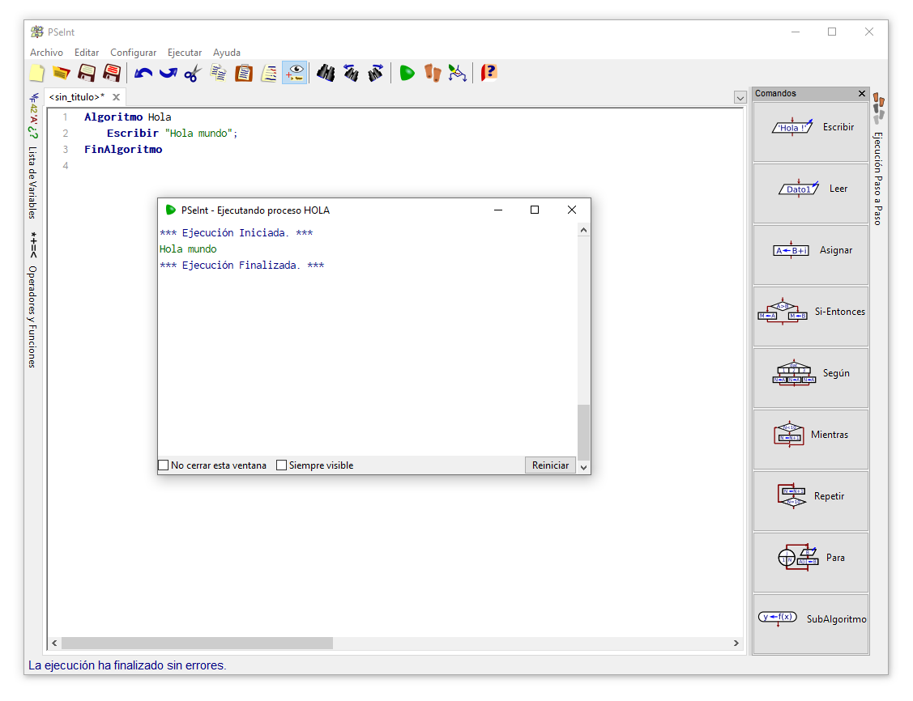

# Curso de Java Básico - Ejercicios | Sesión 1

Instructor: Alan Badillo Salas (dragonnomada@gmail.com)

## 1. Instalación de PSeInt


Descarga el programa llamado **PSeInt** (Pseudocódigo Intérprete).

[http://pseint.sourceforge.net](http://pseint.sourceforge.net)

## 2. Escribe un programa en PSeInt



Abre PSeInt y escribe el siguiente programa.

> Hola.psc

```psc
Algoritmo Hola
	Escribir "Hola mundo";
FinAlgoritmo
```

Ejecuta el programa con `F9` o en la barra de menú en `Ejecutar`.

### 3. Implementa el algoritmo de ordenamiento en burbuja

```txt
lista <- 4, 3, 5, 2, 1, 6

N <- lista.tamaño

PARA i <- 1 HASTA N:
    a <- 0
    inicial <- lista.posicion(a)

    PARA j <- i + 1 HASTA N:
        capturado <- lista.posicion(a + 1)
        SI inicial > capturado:
            lista.ajusta(a, capturado)
            lista.ajusta(a + 1, inicial)
            a <- a + 1
            capturado <- NADA
        SINO:
            a <- a + 1
            inicial <- lista.posicion(j)

PARA i <- 1 HASTA N:
    IMPRIME SIN SALTO lista.posicion(i), " "
```

### 4. Revisa el curso de PLEDIN 3.0 - Introducción al Pseudocódigo


[https://plataforma.josedomingo.org/pledin/cursos/programacion/](https://plataforma.josedomingo.org/pledin/cursos/programacion/)

Responde las siguientes preguntas en tu libreta.

1. ¿Cómo se define un algoritmo/procedimiento en PSeInt?
2. ¿Cómo se define una variable llamada `x` de tipo entero?
3. ¿Cómo se asigna la variable `x` al valor de `123`?
4. ¿Cómo se escribe el mensaje `El total es 123` usando el valor de `x`?
5. ¿Cómo se lee el valor de `x` desde el usuario?
6. ¿Cómo se imprimen los números del 1 al 100?
7. ¿Cómo se determina si `x` es mayor a 100 escribir "Es mayor a 100"?
8. ¿Cómo se define una lista de dimensión 20?

### 5. Implementa el Pseudocódigo del ejercicio visto en clase

Implementa el siguiente pseudocódigo en PSeInt

> Calcular la suma del 201 al 581 de 4 en 4

```txt
S <- 0

PARA valor <- 201 HASTA 581 (valor <- valor + 4):
    S <- S + valor

IMPRIME S
```

