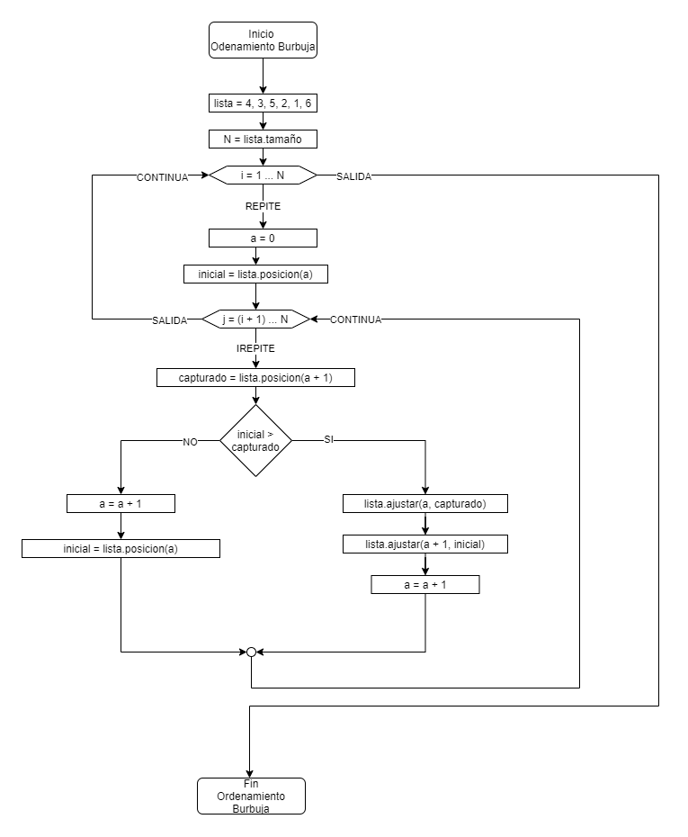
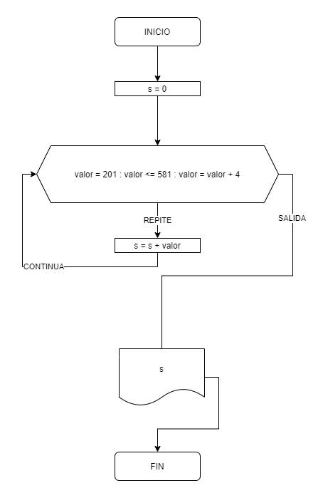

# Algoritmos

## ¿Qué son los algoritmos?

* Instrucciones bien definidas para resolver tareas/procesos de inicio a fin.
* Las instrucciones son finitas y no tienen ambigüedad en sus definición.
* Se basan en la suposición que una máquina abstracta o real será capaz de computarlo.
* Las tareas son problemas que involucran una naturaleza basada en datos.

## Ejemplo de un Algoritmo Humano (no en el contexto de la programación)

> Cómo preparar un café

```txt
1. Inicio
2. Colocar la taza debajo de la cafetera
3. Encender la cafetera
4. Colocar el café
5. Colocar el agua
6. Pulsar el botón de inicio
7. Fin
```

Este algoritmo no puede ser catálogado como tal, parece más una receta y contiene instrucciona ambiguas, por ejemplo, ¿Dónde se coloca el café?, ¿Dónde se coloca el agua? Etc.

## Ejemplo de un Algoritmo Máquina (en el contexto de los datos)

> Ordernar de forma ascendente una lista de números (Algoritmo de Burbuja)

```txt
ENTRADA: lista <- 4, 3, 5, 2, 1, 6

1. Inicio
2. ???????????
?. Fin

SALIDA: 1, 2, 3, 4, 5, 6
```

> INTUICIÓN

```txt
1.    4     3     5     2     1     6
2.   [4]    3     5     2     1     6
3.   [4]   (3)    5     2     1     6
4.   [4] > (3)    5     2     1     6   # Intercambio
5.   (3) * [4]    5     2     1     6   # IDEA [*] > (*)  --> (*) [*]
6.    3    [4]    5     2     1     6
7.    3    [4]   (5)    2     1     6
8.    3    [4] < (5)    2     1     6   # Avanzar
9.    3     4    [5]    2     1     6   # IDEA [*] < (*)  --> * [*]
10.   3     4    [5]   (2)    1     6
11.   3     4    [5] > (2)    1     6   # COMPARACIÓN: POSITIVA
12.   3     4    (2) * [5]    1     6   # INTERCAMBIO
13.   3     4     2    [5]    1     6   # LIBERA ANTERIOR
14.   3     4     2    [5]   (1)    6   # CAPTURA SIGUIENTE
15.   3     4     2    [5] > (1)    6   # COMPARACIÓN: POSITIVA
16.   3     4     2    (1) * [5]    6   # INTERCAMBIO
17.   3     4     2     1    [5]    6   # LIBERA ANTERIOR
18.   3     4     2     1    [5]   (6)  # CAPTURA SIGUIENTE
19.   3     4     2     1    [5] < (6)  # COMPARACIÓN: NEGATIVA
20.   3     4     2     1     5    [6]  # AVANZAR

21.  [3]    4     2     1     5     6   # INICIAR
22.  [3]   (4)    2     1     5     6   # CAPTURA SIGUIENTE
23.  [3] < (4)    2     1     5     6   # COMPARACIÓN: NEGATIVA
24.   3    [4]    2     1     5     6   # AVANZAR
25.   3    [4]   (2)    1     5     6   # CAPTURA SIGUIENTE
26.   3    [4] > (2)    1     5     6   # COMPARACIÓN: POSITIVA
27.   3    (2) * [4]    1     5     6   # INTERCAMBIO
28.   3     2    [4]    1     5     6   # LIBERA ANTERIOR
29.   3     2    [4]   (1)    5     6   # CAPTURA SIGUIENTE

... (N - VECES) `N^2`
```

> REDUCIDA: `3 1 2`

```txt
0. 3 2 1
1. [3] 2 1 # INICIAR (1)
2. [3] (2) 1 # CAPTURAR (1)
3. [3] > (2) 1 # COMPARAR: POSITIVO
4. (2) * [3] 1 # INTERCAMBIAR
5. 2 - [3] 1 # LIBERAR
6. 2 [3] (1) # CAPTURAR (2)
7. 2 [3] > (1) # COMPARAR: POSITIVO
8. 2 (1) * [3] # INTERCAMBIAR
9. 2 1 - [3] # LIBERAR
10. [2] 1 3 # CAPTURAR (3) -> INICIAR (2)
11. [2] (1) 3 # CAPTURAR (1)
12. [2] > (1) 3 # COMPARAR: POSITIVO
13. (1) * [2] 3 # INTERCAMBIAR
14. 1 - [2] 3 # LIBERAR
15. 1 [2] (3) # CAPTURAR (2)
16. 1 [2] < (3) # COMPARAR: NEGATIVO
17. 1 2 ~ [3] # AVANZAR
18. [1] 2 3 # CAPTURAR (3) -> INICIAR (3)
19. [1] (2) 3 # CAPTURAR (1)
20. [1] < (2) 3 # COMPARAR: NEGATIVO
21. 1 ~ [2] 3 # AVANZAR
22. 1 [2] (3) # CAPTURAR (2)
23. 1 [2] < (3) # COMPARAR: NEGATIVO
24. 1 2 ~ [3] # AVANZAR
25. [1] 2 3 # CAPUTURAR (3) -> INICIAR (4) -> FIN
```

> ABSTRACCIÓN

```txt
INICIAR (i)
CAPTURAR (j)
COMPARAR
    POSITIVO:
        INTERCAMBIAR
        LIBERAR
    NEGATIVO:
        AVANZAR
CAPTURAR (j + 1)

---

CAPTURAR (j) -> INICIAR (i + 1) : j = N
INICIAR (i) -> FIN : i > N
```

> SINTETIZACIÓN -> LENGUAJUAGE NATURAL (HUMANO)

```txt
Tenemos una lista de números 4, 3, 5, 2, 1, 6

* `N` es el número de elementos en la lista

Para un contador llamado `i` que comienza en 1 y termina en `N`:
    * `a` es la posición inicial de cero
    El elemento `inicial` es el primer elemento de la lista (a)
    Para un contador llamado `j` que comienza en `i + 1` y termina en `N`:
        El elemento `capturado` es el siguiente elemento al `inicial` (a + 1 ~= j)
        Si el elemento `inicial` es mayor al elemento `capturado`, entonces:
            Intercambia el elemento `inicial`, con el elemento `capturado` (a <- a + 1)
            Libera el elemento `capturado` (ya no hay elemento capturado)
        Sino:
            Avanza el elemento `inicial` como el elemento `capturado` (a <- j)
```

> SINTETIZACIÓN -> LENGUAJUAGE PEUDO-CÓDIGO (HUMANO -> MÁQUINA)

```txt
lista <- 4, 3, 5, 2, 1, 6

N <- lista.tamaño

PARA i <- 1 HASTA N:
    a <- 0
    inicial <- lista.posicion(a)

    PARA j <- i + 1 HASTA N:
        capturado <- lista.posicion(a + 1)
        SI inicial > capturado:
            lista.ajusta(a, capturado)
            lista.ajusta(a + 1, inicial)
            a <- a + 1
            capturado <- NADA
        SINO:
            a <- a + 1
            inicial <- lista.posicion(j)
```

> SINTETIZACIÓN -> LENGUAJUAGE CÓDIGO (MÁQUINA)

```java
// https://jarroba.com/arraylist-en-java-ejemplos/

class OrdenaBurbuja {

    public static void main(String[] args) {

        ArrayList<int> lista = new ArrayList<int>();

        lista.add(4);
        lista.add(3);
        lista.add(5);
        lista.add(2);
        lista.add(1);
        lista.add(6);

        int N = lista.size();

        for (int i = 0; i < N; i++) {
            int a = 0;
            int inicial = lista.get(a);

            for (int j = i + 1; j < N; j++) {
                int capturado = lista.get(a + 1);

                if (inicial > capturado) {
                    lista.set(a, capturado);
                    lista.set(a + 1, inicial);
                    a = a + 1;
                } else {
                    a = a + 1;
                    inicial = lista.get(a);
                }
            }
        }

    }

}
```

> Diagrama de Flujo del Ordenamiento de Bubuja



## Ejercicio

Se desea calcular la suma de los números del `201` al `581` dejando `4` valores entre cada uno, es decir, `201 + 205 + 209 + 213 + 217 + 221 + 225 + ... + 581`.

> INTUICIÓN

```txt
1 + 2 -> 3
1 + 2 + 3 -> (1 + 2) + 3 -> (6) + 3

0 + A + B + C + D + E + F + G + H + ...

(0) + A

(A) + B

(A + B) + C

(A + B + C) + D

(A + B + C + D) + ...

(S) + <valor>

S = 0
---
S = S + <valor>

<valor> 201 ... 581 ? +4

S = 0
valor = 201 : valor <= 581 : valor = valor + 4:
    S = S + valor
```

> PSEUDO-CÓDIGO

```txt
S <- 0

PARA valor <- 201 HASTA 581 (valor <- valor + 4):
    S <- S + valor

IMPRIME S
```

> DIAGRAMA FLUJO



> CÓDIGO (Java)

```java
class Suma {

    public static void main(String[] args) {

        int s = 0;

        for (int i = 201; i <= 581; i++) {
            s = s + 4;
        }

        System.out.println(s);

    }

}
```

[Ejecutar este código](https://replit.com/@DragonNomada/Suma-3)