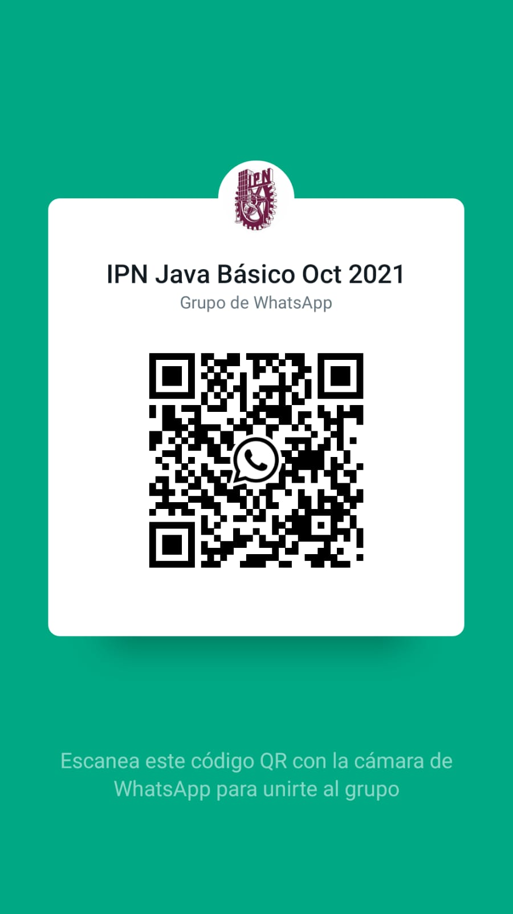

# Curso de Java Básico del IPN CIC

Instructor: Alan Badillo Salas (dragonnomada@gmail.com)

## NOTICIAS

* **Martes 19 de Octubre de 2021** - Ya están disponibles los ejercicios de la clase. [Ver ejercicios de la Sesión 1](./exercises/sesion_1.md)

## Presentaciones

1. [Introducción](https://slides.com/d/AgfBF6A/live)

## Grupo de Whatsapp

[https://chat.whatsapp.com/EgIDb7q17SsGygf7cQur5I](https://chat.whatsapp.com/EgIDb7q17SsGygf7cQur5I)